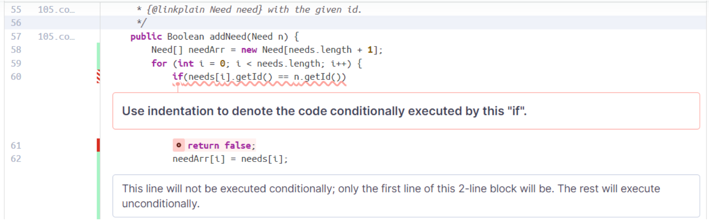

# PROJECT Design Documentation

> _The following template provides the headings for your Design
> Documentation.  As you edit each section make sure you remove these
> commentary 'blockquotes'; the lines that start with a > character
> and appear in the generated PDF in italics but do so only **after** all team members agree that the requirements for that section and current Sprint have been met. **Do not** delete future Sprint expectations._

## Team Information
* Team name: GetTheJobDone
* Team members
  * Ishan Dhar
  * Miles Sopchak
  * Oscar Chen
  * Kevin Chen

## Executive Summary

Our project is an innovative web application designed to streamline the process of food donation. The application serves as a digital bridge connecting donors with the needs of communities, enabling users to efficiently donate food items that are in demand. 

### Purpose
>  _**[Sprint 2 & 4]** 
Our project is an innovative web application designed to streamline the process of food donation. The application serves as a digital bridge connecting donors with the needs of communities, enabling users to efficiently donate food items that are in demand. 

### Glossary and Acronyms
> _**[Sprint 2 & 4]** Provide a table of terms and acronyms._

| Term | Definition |
|------|------------|
API	| Application Programming Interface
DAO	| Data Access Object
HTTP	| Hypertext Transfer Protocol
JSON	| JavaScript Object Notation
MVC	| Model-View-Controller
REST	| Representational State Transfer
SRP	| Single Responsibility Principle
DIP	| Dependency Inversion Principle
ISP	| Interface Segregation Principle
UI	| User Interface
UX	| User Experience
ORM	| Object-Relational Mapping
OOD	| Object-Oriented Design
SPA	| Single Page Application

## Requirements

This section describes the features of the application.

> _In this section you do not need to be exhaustive and list every
> story.  Focus on top-level features from the Vision document and
> maybe Epics and critical Stories._

### Definition of MVP
> _**[Sprint 2 & 4]** 
The MVP is a website that lists what food is needed, how much of it is needed, a user login, an admin login, 
and a shopping cart feature. 

### MVP Features
> The User should be able to see a list of needs, search for needs, and add needs to a shopping cart
> The User should be able to create an account, login, and sign out to save their cart for later
> The User should have a personal cart to add needs to, manage needs in their cart at any time, and checkout their cart and have an empty cart after checking out
> Users should have a easy to access website to navigate through
> Admins should be able to manage the inventory of needs
> Admins should be able to monitor logins and remove accounts if requested
### Enhancements
> _**[Sprint 4]**
> One enhancement was a volunteer schedule where users can sign up to help distribute goods at locations at a certain date, place, and time.
> Another enhancement was a table showing food drop off locations so users can see where their contributions are going

## Application Domain

This section describes the application domain.

> _**[Sprint 2 & 4]** 
Users should be able to interact with the shopping cart and login. The admin should be able to interact with the needs so it can update it, as well as a shopping cart and login. 

## Architecture and Design

This section describes the application architecture.

### Summary

The following Tiers/Layers model shows a high-level view of the webapp's architecture. 
**NOTE**: detailed diagrams are required in later sections of this document.
> _**[Sprint 1]** (Augment this diagram with your **own** rendition and representations of sample system classes, placing them into the appropriate M/V/VM (orange rectangle) tier section. Focus on what is currently required to support **Sprint 1 - Demo requirements**. Make sure to describe your design choices in the corresponding _**Tier Section**_ and also in the _**OO Design Principles**_ section below.)_

The web application, is built using the Model–View–ViewModel (MVVM) architecture pattern. 

The Model stores the application data objects including any functionality to provide persistance. 

The View is the client-side SPA built with Angular utilizing HTML, CSS and TypeScript. The ViewModel provides RESTful APIs to the client (View) as well as any logic required to manipulate the data objects from the Model.

Both the ViewModel and Model are built using Java and Spring Framework. Details of the components within these tiers are supplied below.

### Overview of User Interface

This section describes the web interface flow; this is how the user views and interacts with the web application.

> _Provide a summary of the application's user interface.  Describe, from the user's perspective, the flow of the pages in the web application._

### View Tier
> _**[Sprint 4]**
> Step 1: Landing Page and Product Browsing
> User Interface Components: As soon as the user lands on the homepage after logging in, they are greeted with a navigation bar and a search box. Each of these elements is a UI component designed to enhance user interaction, from searching for a specific item or browsing through categories.

> Layout Managers: These components are neatly arranged on the page using layout managers. The layout ensures that elements are well-spaced and organized, providing a clean and attractive browsing experience whether the user is on a desktop or a mobile device.

> Views/Pages: As the user clicks on the cupboard category, they are taken to a new view that lists products in that category, each represented by brief descriptions, and prices.
> Step 2: Detailed Product View
> Containers: When a user clicks on a need, they are directed to a product detail page, and the “Add to Cart” button.

> Data Binding Components: On the product detail page, data binding components ensure that all displayed information is current. For example, the availability status is updated in real-time, reflecting the current inventory levels without requiring a page refresh.

> Step 3: Adding Products to the Shopping Cart

> When the user decides to add a product to their cart, the website quickly updates the cart's interface to reflect the new item. This is done without reloading the page, providing an instant update that enhances the user's shopping experience.

> As items are added to the cart, the total cost is recalculated dynamically,

> Step 4: Checkout Process
> Views/Pages: The checkout process might span multiple views/pages, each designed to complete a section of the process such as shipping address, and order confirmation. Each view is rendered based on the user's progress through the checkout process.
Here is an example diagram of a user searching for an item and adding it to their basket:

Here is an example diagram of a user logging into their account:

Layout Managers: These ensure that the checkout form adapts responsively across different devices, helping maintain usability and accessibility, ensuring fields and buttons are easily navigable on any device.

> _**[Sprint 4]** You must  provide at least **2 sequence diagrams** as is relevant to a particular aspects 
> of the design that you are describing.  (**For example**, in a shopping experience application you might create a 
> sequence diagram of a customer searching for an item and adding to their cart.)
> As these can span multiple tiers, be sure to include an relevant HTTP requests from the client-side to the server-side 
> to help illustrate the end-to-end flow._

> _**[Sprint 4]** To adequately show your system, you will need to present the **class diagrams** where relevant in your design. Some additional tips:_
 >* _Class diagrams only apply to the **ViewModel** and **Model** Tier_
>* _A single class diagram of the entire system will not be effective. You may start with one, but will be need to break it down into smaller sections to account for requirements of each of the Tier static models below._
 >* _Correct labeling of relationships with proper notation for the relationship type, multiplicities, and navigation information will be important._
 >* _Include other details such as attributes and method signatures that you think are needed to support the level of detail in your discussion._

### ViewModel Tier
> _**[Sprint 1]** 
NeedController handles REST API requests for managing Need resources, such as retrieving, creating, updating, and deleting needs. It translates user actions into operations on the model and selects the appropriate view for response.

UserController is responsible for processing REST API requests related to user operations, such as login, logout, account creation, updates, and admin status checks. It acts as a bridge between the user interface and the model, handling HTTP requests and responses.

> _**[Sprint 4]**
> The ViewModel Tier in an MVVM architecture acts as a mediator between the View Tier and the Model Tier, handling data processing, state management, and interaction logic. It plays several key roles:

> Key Components and Responsibilities
> Data Model Proxies: These manage interactions with the backend data models, ensuring data consistency and handling synchronization.

> Command Handlers: They translate user actions from the View Tier into operations that affect the data model, encapsulating business logic and validation.

> Validators: These ensure data entered by users meets business rules and constraints before it's processed or sent to the Model Tier.

> State Managers: They maintain the UI's state across different user interactions, helping manage data like user sessions or multi-step forms.

> Data Transformers: Convert and format raw data from the Model Tier into user-friendly formats suitable for display in the View Tier.

> Usage Example
In an application, when a user edits their profile, the ViewModel:
> Retrieves and formats initial data using data transformers.
Validates new inputs via validators as the user types.
Processes the save action through command handlers, applying business rules.
Updates the UI based on success or error outcomes using state managers.

> _At appropriate places as part of this narrative provide **one** or more updated and **properly labeled**
> static models (UML class diagrams) with some details such as critical attributes and methods._
> 

### Model Tier
> _**[Sprint 1]** 
The User class models a user in the system, with properties like username, id, key, password, and admin status. It provides methods for user operations such as login, password hashing, key generation, and admin status checks.

The Need class represents the entity of a need within the food donation system. It holds the information for each need, such as id, name, type, cost, and quantity, and includes methods to get and set these properties. This class forms part of the model tier as it directly models the data the application will use.

The NeedDAO interface defines the data access operations for the Need entity, such as retrieving, finding, creating, updating, and deleting Need objects. It handles interactions with the underlying storage mechanism, which is essential for maintaining persistence and querying data related to needs in the food donation system.

The UserDAO interface is responsible for defining the operations required to manage User entities, including login, logout, admin status checks, user creation and deletion, and user information updates.

NeedFileDAO is an implementation of the NeedDAO interface, providing JSON file-based persistence for Need objects. It manages the serialization and deserialization of Need objects to and from a file, serving as a concrete class for data access. 

UserFileDAO implements the UserDAO interface and offers JSON file-based persistence for User objects. It provides functionality for saving and loading user information from a file

> _**[Sprint 2, 3 & 4]**
> The Model Tier of an application is fundamental, focusing on data management and business logic. It consists of several critical components:

> Data Models: Define the structure of data and ensure logical organization and integrity.
> Business Logic: Implements the core rules and algorithms of the application, handling data processing and decision-making.
> Data Access Objects (DAOs): Provide an abstraction layer for database interactions, ensuring data is retrieved and stored securely.
> Service Layer: Coordinates complex business processes, facilitating communication between the business logic and client-facing interfaces.
> Data Transfer Objects (DTOs): Optimize data flow between processes, particularly in networked environments, by minimizing the amount of data transferred.
> section will follow the same instructions that are given for the View
> Tier above._

> _At appropriate places as part of this narrative provide **one** or more updated and **properly labeled**
> static models (UML class diagrams) with some details such as critical attributes and methods._
> 

## OO Design Principles

Sprint 1:
We have discussed the use of single responsibility principle, abstraction, and encapsulation in our project. 

Sprint 2-4: 
Encapsulation is evident in how we've structured our entities (User, DropOffLocation) and control logic (controllers, services, DAOs) into classes with specific responsibilities.
Abstraction is used in defining service and DAO interfaces, separating what operations can be done from how they are implemented.
Single Responsibility Principle (SRP) ensures each class (e.g., User, NeedDAO) focuses on a single aspect of our application, promoting clarity and ease of maintenance.
Open/Closed Principle (OCP) is reflected in our design allowing classes to be extended without modification, particularly through the use of interfaces and abstract classes.
Dependency Inversion Principle (DIP) manifests in our application through the use of interfaces for DAOs, decoupling high-level modules from low-level modules.
Controller is applied via classes like UserController, directing application flow and delegating tasks to specific services or DAOs.
Information Expert is demonstrated by assigning responsibilities to the classes with the most relevant information, such as entity classes handling their own data.
Low Coupling is achieved through a modular design where components, such as services and DAOs, have minimal dependencies on each other.
Pure Fabrication is seen in the creation of DAO classes that don't directly represent domain concepts but facilitate database interactions.
Law of Demeter is implicitly followed by ensuring classes interact primarily with closely related objects, thereby reducing dependencies and potential complexities

> _**[Sprint 4]** OO Design Principles should span across **all tiers.**_

## Static Code Analysis/Future Design Improvements

This issue is identified by SonarQube on the file CartController file, and it is listed as high severity on maintainability. This is an issue because this is a string that appears in multiple places within the code which makes refactoring more difficult and time consuming where any change in one place would need to be changed in every occurrence. To fix this issue one way is to make the string literal as a constant. This would allow someone cleaning the code or working on it to only change one instance without manually changing every instance of the literal, which would make maintaining the code easier.

This issue is identified by SonarQube on the file Cart. This issue is listed as having a high impact on maintainability within the code. This is an issue because it can cause some problems with readability where if there were multiple things to be done it would not be clear what thing to be done under the if condition. This would be more confusing for the maintainer if there are multiple things to do and they would not know if the if condition would do multiple things or just one thing. To fix this issue it would be to make it clear what the if condition would do when it is run by adding curly braces which would make it easier to read and understand.

This issue is identified by SonarQube on the userguard.ts file. This issue is listed as having a high impact on maintainability within the code. This is an issue because the function has a high cognitive complexity which is how hard a code is to understand, modify, and test. This code can be difficult to understand with it doing multiple tasks. So, with someone trying to maintain the code it would take some time for them to understand how the function worked. To fix the complexity of the code it could be to break up the code into smaller, more understandable code so the person would be able to understand the smaller code and not the larger more complex code.

> UX upgrades:
> Improving our CI/CD pipelines to include more comprehensive automated testing would help ensure that changes do not break existing functionality. This would include unit tests, integration tests, and UI tests, potentially utilizing service virtualization to mimic various service interactions for thorough testing scenarios.
> To handle larger datasets and improve performance, database refactoring might be necessary. Implementing database sharding to distribute data across multiple databases can help in managing larger datasets and increasing database transaction speed. Additionally, we would look into optimizing existing SQL queries and indexes to enhance retrieval times.

## Testing
> _This section will provide information about the testing performed
> and the results of the testing._

### Acceptance Testing
> _**[Sprint 2 & 4]** 
> 8 in testing
> 7 done (from Sprint 1)
> all user stories completed as of Sprint 3
> all tests passed
> Report on the number of user stories that have passed all their
> acceptance criteria tests, the number that have some acceptance
> criteria tests failing, and the number of user stories that
> have not had any testing yet. Highlight the issues found during
> acceptance testing and if there are any concerns._

### Unit Testing and Code Coverage
> _**[Sprint 4]** Discuss your unit testing strategy. Report on the code coverage
> achieved from unit testing of the code base. Discuss the team's
> coverage targets, why you selected those values, and how well your
> code coverage met your targets._

>_**[Sprint 2 & 4]** **Include images of your code coverage report.** If there are any anomalies, discuss
> those._

## Ongoing Rationale
>_**[Sprint 1, 2, 3 & 4]** Throughout the project, provide a time stamp **(yyyy/mm/dd): Sprint # and description** of any _**mayor**_ team decisions or design milestones/changes and corresponding justification._
